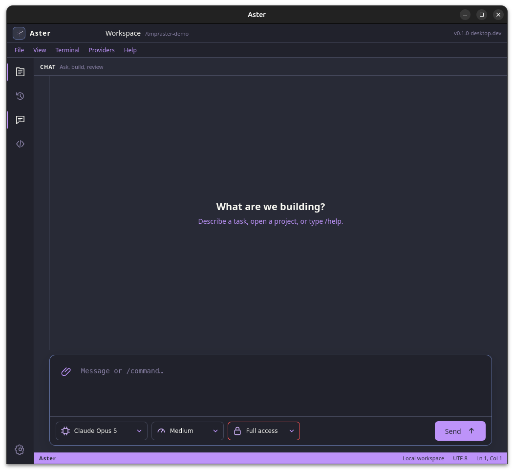
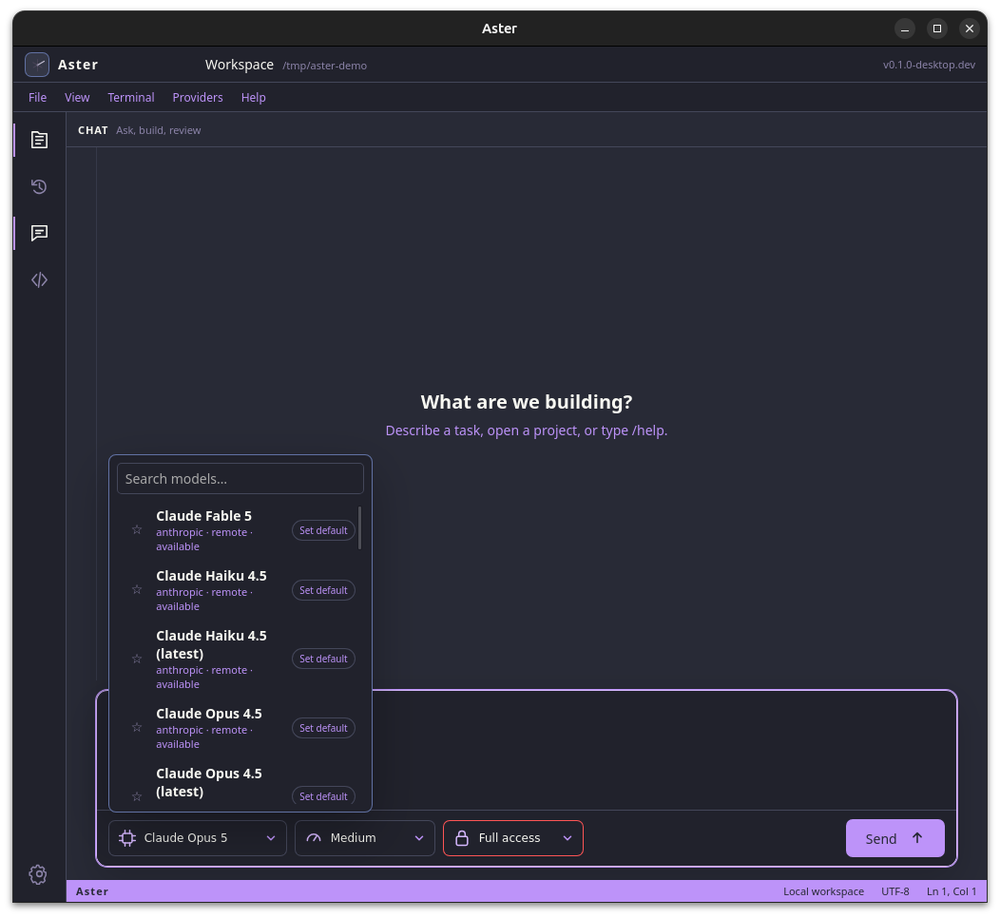
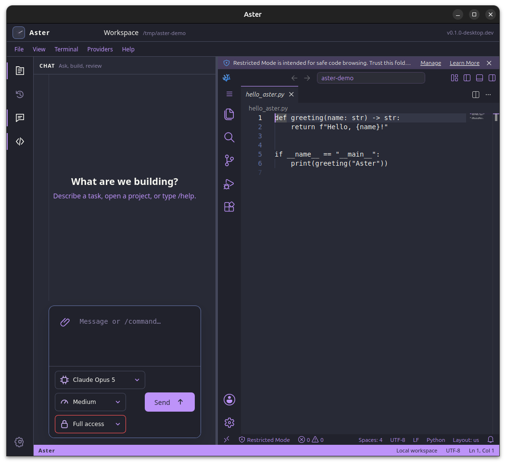
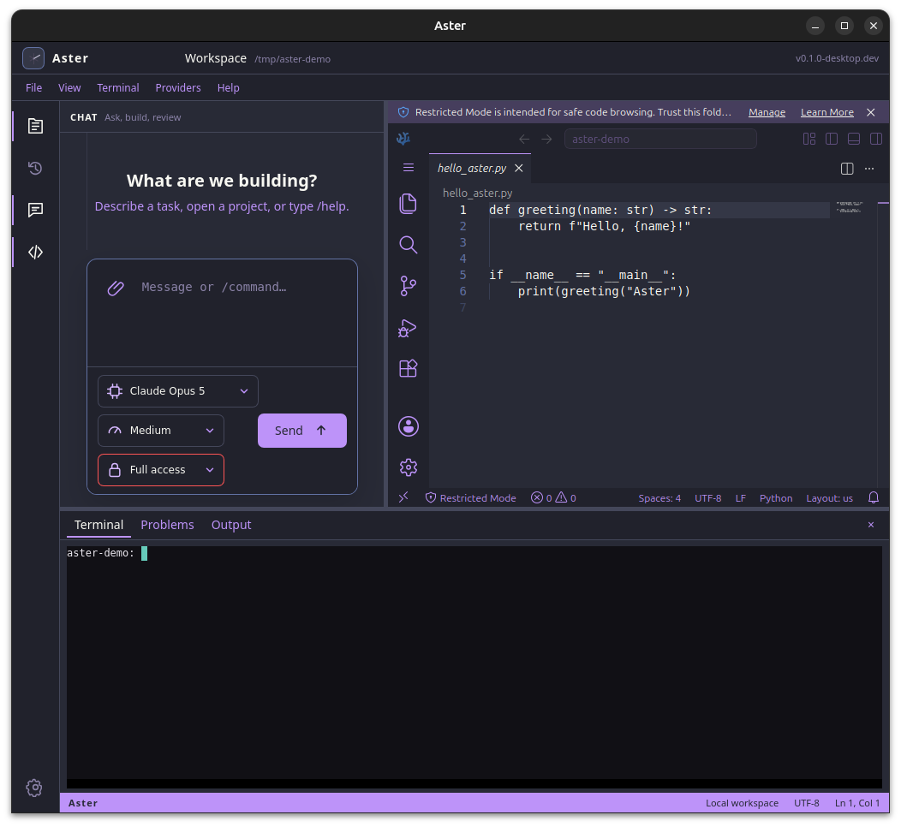
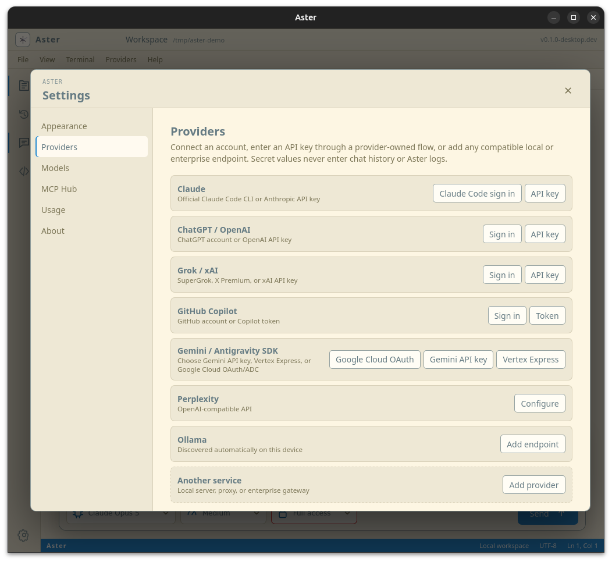

# Aster User Guide

Aster is a Linux-first AI workbench that brings local models, remote providers,
chat, orchestration, VSCodium, a terminal, and MCP tools into one application.
This guide covers normal desktop operation. The project README contains build,
packaging, and command-line instructions.



## 1. Start Aster

Launch **Aster** from the Linux application menu. AppImage users can also run:

```bash
./Aster_0.1.0_amd64.AppImage
```

At startup, choose one of these paths:

- **Open Folder** loads an existing project as the active workspace.
- **New Workspace** selects a directory for new work.
- **New Chat** opens the chat surface without requiring a project.
- **Open File** opens one file in the editor.
- **Open Recent** restores a locally retained task.

When no folder has been chosen, Aster starts safely in the user's home
directory. For coding work, open the intended project folder first so models,
tools, the Explorer, and the terminal share the same workspace boundary.

## 2. Understand the workspace

The left activity rail opens the main surfaces:

- **Explorer** browses the active workspace and opens selected files in the
  embedded editor.
- **Task History** shows previous local chats and checkpoints.
- **Chat** returns focus to the conversation.
- **Editor** opens or closes embedded VSCodium.
- **Settings** controls appearance, providers, model defaults, MCP servers,
  usage, and application information.

Use the **View** menu to show or hide the Explorer, task history, editor,
terminal, Problems, and Output panels. Drag the dividers between visible panels
to resize them. **View → Reset Layout** restores the default arrangement.

## 3. Choose a model



The model control below the composer contains every discovered model in one
searchable list. Provider names such as Ollama, Anthropic, or OpenAI appear as
metadata; they are not pseudo-model choices.

1. Open the model selector.
2. Search for a model or scroll through the list.
3. Select the exact model to use for the next phase.
4. Optionally choose **Set default** to make it that provider's fallback model.

Open **Settings → Models** to review or change all provider defaults. An
explicit model named in a prompt wins over a default. If a requested model is
unavailable, Aster reports the failure instead of silently substituting one.

## 4. Choose effort and execution mode

Providers that expose reasoning effort show an effort selector beside the
model. Ollama and Gemini use their own model/runtime controls, so Aster does not
show an artificial effort control for them.

The execution modes are:

- **Plan** — inspect and propose without modifying the workspace.
- **Manual** — request approval before mutating actions.
- **Auto** — perform policy-compliant workspace edits and checks without an
  approval for every action.
- **Full access** — allow configured tools without per-action approval. Aster
  displays a warning before enabling it; provider and platform boundaries still
  apply.

The selected mode is locked when a phase begins. Changing it affects the next
phase, not work already running. Chat alternatives are `/mode plan`, `/mode
manual`, `/mode auto`, and `/mode full`. The `/plan` command starts a read-only
planning phase.

## 5. Chat with a model

Enter a request in the composer and select **Send**, or use the configured
keyboard shortcut. The composer grows as a long prompt is entered and returns
to its compact height after submission.

Useful chat behavior:

- Select the paperclip, drag files into chat, or paste a copied file to attach
  context.
- Press **Up Arrow** to recall earlier prompts.
- Hover a previous user message and choose **Rewind** to branch safely from that
  point without destroying the original conversation.
- Expand a collapsed **Tools** disclosure to inspect commands, tool calls,
  results, and permission decisions.
- Check the badge on each assistant response to see its exact provider and
  model.
- Use **Stop** to request cancellation of an active task.

Never paste passwords, API keys, OAuth tokens, or session cookies into chat.

## 6. Attach files safely

Aster accepts up to 10 files per message and 25 MB per file.

- Text and source files become bounded model context.
- PDF text is extracted locally.
- PNG, JPEG, WebP, and GIF images are sent only when the selected model supports
  image input.
- Unsupported binary files are rejected.

Attachments are copied into Aster's private staging directory. When a remote
model is selected, Aster identifies the files and asks before their contents
leave the device. Select a local Ollama model when attached content must remain
on the machine.

## 7. Use the Explorer and editor



Open the Explorer and select a file to start embedded VSCodium. You can also
open **Editor** before choosing a file; VSCodium starts in the active workspace
and is ready for normal editing.

The embedded editor follows Aster's selected color theme. Standard VSCodium
features such as syntax highlighting, file creation, search, source control,
extensions, and editor commands remain available within the embedded surface.
VSCodium may initially mark an unfamiliar folder as restricted; use its trust
controls only when you recognize and trust the project.

Save a file before running checks. Editing a previously verified file marks its
verification stale until checks are run again.

## 8. Use the integrated terminal



Choose **Terminal → Show Terminal** or use `Ctrl+\`` to open the terminal panel.
It starts in the active workspace and can be resized by dragging its upper
divider. Use the close control on the panel or repeat the shortcut to hide it.

The integrated terminal is a real local shell. Commands run with the user's
normal operating-system permissions, so review destructive commands before
executing them.

## 9. Connect providers



Open **Settings → Providers**. Available connection paths include:

- **Claude** — the official Claude Code CLI or an Anthropic API key.
- **ChatGPT / OpenAI** — provider login or an OpenAI API key.
- **Grok / xAI** — provider login or an xAI API key.
- **GitHub Copilot** — GitHub login or a Copilot token.
- **Gemini / Antigravity SDK** — Google Cloud OAuth/ADC, Gemini API key, or
  Vertex Express.
- **Perplexity** — an OpenAI-compatible API connection.
- **Ollama** — automatic local discovery, with optional additional endpoints.
- **Another service** — a compatible local server, proxy, or enterprise API.

Aster stores connection metadata and credential references, not displayed
secret values. Authentication remains owned by the relevant provider, official
CLI/SDK, environment variable, or external secret command.

After connecting a provider, open the model selector. If its models do not
appear, close and reopen the selector, then check the provider status in
Settings. For local models, confirm that Ollama is running on
`127.0.0.1:11434`.

## 10. Request multi-model orchestration

Describe the roles directly in chat. For example:

```text
Use my default Ollama model to inspect this workspace and propose a small
improvement. Then use my default OpenAI model to implement the approved change.
Finally, ask my default Anthropic model to perform a read-only audit. Report the
exact provider and model used for each phase, the files changed, checks run, and
the final verdict. Do not silently substitute models or delegate further from
the audit phase.
```

Aster resolves provider-only roles through **Settings → Models**. Exact
provider-qualified models in the prompt override those defaults. Each delegated
phase receives its own locked provider, model, effort, mode, workspace, and
bounded result.

## 11. Add MCP tool servers

Open **Settings → MCP Hub** to add tools without editing configuration by hand.
You can:

- add a local stdio command;
- add a remote MCP HTTP endpoint;
- import a standard `mcpServers` JSON object;
- test and discover tools;
- enable, disable, or remove configured servers.

Do not place credential values directly in MCP JSON. Use an environment
placeholder such as `${GITHUB_TOKEN}` so Aster resolves it only when launching
the server.

## 12. Themes, usage, and local records

- **Settings → Appearance** changes Aster and embedded VSCodium together.
- **Settings → Usage** shows locally measured input, output, and total tokens by
  provider and model. It does not represent subscription balances.
- **Task History** and checkpoints remain local unless explicitly exported.
- Community operational logging is off by default. Managed installations may
  enable visibly disclosed logging by policy.

## 13. Troubleshooting

### No Ollama models appear

```bash
ollama list
curl http://127.0.0.1:11434/api/tags
law doctor
```

Start `ollama serve` if the loopback endpoint is unavailable.

### Claude does not answer

```bash
claude --version
claude auth status
```

Claude phases use the official Claude Code bridge. Aster surfaces provider,
authentication, or usage-limit errors returned by that CLI.

### Google authentication fails

Google Cloud ADC requires an active project and permission for the Cloud
Platform scope. If an administrator blocks that scope, use the documented
Gemini API key or Vertex Express route instead.

### The editor does not initialize

Close and reopen the Editor surface. If using an AppImage, ensure the AppImage
is executable and restart Aster so its bundled runtime can initialize cleanly.

### Aster reports degraded status

Run:

```bash
law doctor
law doctor --json
```

`degraded` can indicate that an optional capability, such as a container
engine, is unavailable while attended or read-only work remains usable.

## 14. Safety reminders

- The selected workspace is the intended filesystem boundary for model work.
- Pi and Aster's policy interception are not an operating-system sandbox.
- Use Plan or Manual mode for unfamiliar repositories and tools.
- Review diffs and run checks before committing or publishing changes.
- A model's success message does not prove that code was committed, pushed, or
  deployed.
- Use Git to collaborate between workstations; Aster intentionally does not
  link machines or share live local-agent state.

For development, packaging, MCP client registration, and CLI instructions, see
the [project README](../README.md) and [Codex MCP guide](CODEX-MCP.md).
